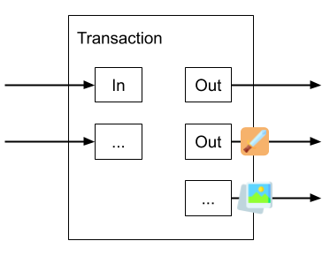

# Chapter 1. Background Knowledge

The goal of this guide is to build a basic wallet adapter for Run. Your new adapter will allow third-party apps to use your wallet in combination with Run, not only to make payments but also to store and use jigs.

A common request from app developers is that they would like their users to be able to login to their app using a wallet, similar to Login with Google or Facebook, and then for users to be able to access their data. Apps like Twetch do this today. However, compared to other OP_RETURN protocols, Run takes a little more work to support. Making these changes will be worth it.

Wallets are experts at securing keys. App developers, generally, are not. We think that private keys should be fully managed by wallets and should never be exposed to the app developer or to Run. We'll build towards that design in this guide.

Before continuing, it would be good to take [Run Tutorial #1](https://run.network/lessons/mockchain-jig-web-console/) to get a general understanding of what Run does. Now, let's get started.

## Tokens in Unspent Outputs

Run is a UTXO-based token protocol. All jigs and code that you own are stored in UTXOs. If you control a particular UTXO, you control that token. If you can spend a jig UTXO, then you can update that jig's data. Similarly, querying your UTXOs is the same as querying your resources.

There's nothing special about a jig UTXO. They are generally dust outputs, and if you looked at one by itself, it would look like any other payment UTXO. However, its *meaning* within Run is derived from a separate OP_RETURN output that is present in every Run transaction. This design is similar to [SLP](https://simpleledger.cash/) and other colored coin protocols.

Unfortunately, it also means that special care must be taken not to accidentally spend token outputs since they look identical to payment outputs. Run uses separate keys for tokens and payments for this reason. While the approach makes Run more difficult to integrate for wallets, it makes jigs more secure for users and developers.

## The Owner and the Purse

Run requires two sets of keys to use:

* The **owner** is the account that stores the user’s jigs and code

* The **purse** is the account that pays for a transaction and its miner fees

When learning Run, users learn they can specify these accounts as private keys:

    new Run({ owner: '<owner key>', purse: '<purse key>' })

But that's not the full story. Run actually accesses these two accounts through APIs. It never *needs* to see the private keys. An owner is just an implementation of the `Owner API`, and a purse is just an implementation of the `Purse API`. When the user specifies private keys like above, Run actually creates instances of `LocalOwner` and `LocalPurse` that implement these APIs. You'll find these APIs documented in the API Reference section of the Run docs.

By implementing these APIs, a wallet can store the keys securely in an iframe or on a backend, sign everything there, and send signed transactions back to Run over a secure channel.

## How Run Builds a Transaction

To grasp how these APIs are used in Run, it is useful to walk through a couple of examples.

When you type:

	dragon.setName('Empress')

Run internally builds a *partial transaction* that looks like:

| Inputs | Outputs |
|--------|---------|
| P2PKH Dragon instance 546 satoshis **UNSIGNED** | OP_RETURN `dragon.setName('Empress')` |
| | P2PKH Dragon instance 546 satoshis |

Miners will not accept this transaction because there are no miner fees. So, Run calls the purse’s `pay()` method and passes in this partial transaction. The purse's job is to add the inputs and outputs necessary to make this transaction acceptable to miners. Then, the purse signs the payment inputs it added and returns the updated transaction back to Run. The updated transaction might look like:

| Inputs | Outputs |
|--------|---------|
| P2PKH Dragon instance 546 satoshis **UNSIGNED** | OP_RETURN `dragon.setName('Empress')` |
| P2PKH Payment 10000 satoshis **SIGNED** | P2PKH Dragon instance 546 satoshis |
| | P2PKH Change 9000 satoshis |

Input #2 and Output #3 were both added by the purse. However, Input #1 is still unsigned. It was not possible to sign Input #1 before all payment inputs and outputs were added. So, this transaction is now sent to the owner’s `sign()` method to approve the jigs that were updated. The `sign()` method is passed information that Input #1 is a jig so it knows which inputs to sign. `sign()` will return a fully signed transaction.

The transaction is now complete and Run will broadcast it.

### Creating New Jigs

There is a second flow to build a transaction when you create new resources. When you type:

    new Dragon()

Run creates two token outputs, one for the `Dragon` class, and one for the `new Dragon()` instance. The partial transaction here looks like:

| Inputs | Outputs |
|--------|---------|
| | OP_RETURN `new Dragon()` Dragon code: "class Dragon extends Jig { }" |
| | P2PKH Dragon class 546 satoshis |
| | P2PKH Dragon instance 546 satoshis |

Notice there are no inputs. This is because new resources are created from scratch and assigned to *initial owners*. Their initial owners are determined by the `Owner API`.Upon executing `new Dragon()`, Run calls the `nextOwner()` method, and the value it returns is assigned to `Dragon.owner` and `dragon.owner`. The `nextOwner()` method normally returns an *address*, specifically an address for a private key that the wallet controls. Then, Run uses these initial owners to build the output scripts in the partial transaction just like the example before, and the rest of the flow is the same.

Implementing `nextOwner()` will be covered in [Chapter 3: Implementing Owner](03-owner.md).

## Where to go from here?

Congratulations! This is all you need to know for now. In [Chapter 2: Implementing Purse](02-purse.md), we will implement the `Purse API` for your wallet to pay for transactions.

For a deeper dive into Run transactions:

* Use Run to create a transaction with multiple jig inputs and outputs
* Use Run to create a backed jig and then inspect the transaction
* Set a jig owner to a `GroupLock` and then inspect the transaction
* Read the *How it Works* section of the Run documentation
