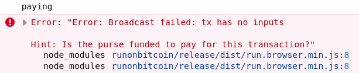
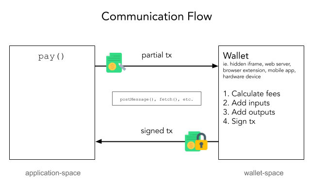

# Chapter 2. Implementing Purse

In this chapter, you'll implement the `Purse API`. You'll create a wallet adapter that calls your wallet and then you'll use it to pay for a few jigs. Make sure to read [Chapter 1](01-background.md) first to understand how `pay()` fits into Run's overall flow. Now let's get started.

## The Purse API

Here is Run's `Purse API`:

    class Purse {
        async pay(txhex: string, spent: number) : string
        async broadcast(txhex: string)
    }

This is what you'll be implementing. Users will pass your wallet adapter as the purse when creating run:

    new Run({ purse: myWallet })

For the rest of this chapter, we'll focus on implementing and testing the `pay()` method. The `broadcast()` method is optional and covered in [Chapter 4: Advanced Considerations](04-advanced.md).

## Getting started

Begin by opening the `starter` project in this repository. It contains two files:

* `my-wallet.js` - Wallet adapter class that we'll fill in
* `test.html` - Webpage that tests the wallet adapter

The wallet adapter is designed for a *browser* wallet. If your wallet is designed for a node server, go ahead now and convert this template project to suit your wallet.

Inside `my-wallet.js`, you'll find this placeholder:

```
class MyWallet {
    pay(txhex, spent) {
        const tx = new bsv.Transaction(txhex)

        // >>>>>>>>>>>>>>>>>>>>>>>>>>>>
        // TODO: Implement this section
        // <<<<<<<<<<<<<<<<<<<<<<<<<<<<

        return tx.toString('hex)
    }
}
```

Let's add a log statement to show that `pay()` can be called. Paste this into the `pay()` method:

    console.log('paying')

In order to hook up the wallet, let's create a test case. Open `test.html` and paste the following into `runTests()`:

```
const run = new Run({ purse: new MyWallet(), network: 'main' })

class Dragon extends Jig { }

const dragon = new Dragon()

await run.sync()
```

This code creates a new instance of Run using our purse. Then, we create a new Dragon jig and `sync()` it to the mainnet blockchain. During `sync()`, Run produces a transaction that has one `OP_RETURN` and two resource outputs similar to our second example in [Chapter 1](01-background.md). Run then calls the `pay()` method, as well as the owner's `sign()` method, before broadcasting the transaction. We didn't specify an `owner` so one will be randomly generated.

The time has come to try it. Open `test.html` in your favorite web browser and then open its web console. You should see two lines.



The first line is the string "paying". Congratulations, our wallet is being called!

But uh oh. We have an error: `Error: Broadcast failed: tx has no inputs`. To get this test to pass, we'll need to add code to the `pay()` method that adds transaction inputs. This will be specific to your wallet, and the remainder of the guide will offer tips on how to do that and ensure it works.

## The pay() method

The job of the `pay()` method is to make the transaction acceptable to miners. It adds inputs and outputs to raise its fee and then signs the transaction. There are two parameters passed to `pay()`, `txhex` and `spent`. 

`txhex` is the partial transaction that Run builds. You should first inflate this transaction into an object to add additional inputs and outputs. The [bsv library](https://github.com/moneybutton/bsv), while optional, is capable of inflating the hex transaction via

    new bsv.Transaction(txhex)

and converting it back to hex again via

    tx.toString('hex')

The second parameter, `spent`, is the total amount of satoshis spent as inputs in the transaction. Output amounts are part of every Bitcoin transaction, but input amounts are not. You may find this value helpful when calculating the miner fee. Finally, the return value for `pay()` should be the paid transaction in hex format.

To implement `pay()`, the first step is to establish a two-way connection between your adapter and your wallet.

### Setting up two-way communication

While in theory we could add every input and sign the transaction inside the adapter's `pay()` method, to hide private keys and other secrets, it's better if signing instead happens in the wallet. That way the application never has a chance to see the user's private keys. Wallets come in many forms, so communication will be unique to your wallet. Your wallet may be an `iframe`, a web server, a browser extension, or even a hardware device. But regardless of the approach, this communication is likely to be asyncronous, so you'll notice the `pay()` method is also async.



If your wallet runs in a hidden `iframe`, you may use [postMessage](https://developer.mozilla.org/en-US/docs/Web/API/Window/postMessage) to send the transaction to your wallet and `addEventListener` to capture it. Then, the wallet can pay for the transaction securely. After the transaction is paid, the wallet sends the transaction back to the adapter using `postMessage`, and the adapter receives it and returns it to Run. Data that crosses these boundaries will be serialized, so we recommend passing transactions in hex to be safe.

Other wallet backends require different yet similar code to send and receive the transaction. You'll find an example of using `fetch()` to talk to an express server in the `demo` project.

Once you have two-way communication set up, test it by logging transactions in both application space and wallet space.

### Paying for a transaction

It is likely that your wallet already has a method to pay for a transaction, so we won't linger on the details. A general strategy is:

1. Add enough UTXOs to more than cover the transaction
2. Calculate the expected miner fees
3. Add a change output, returning all but the fee back to the purse
4. Sign the new inputs added

Calculating the miner fee *is* worth dwelling on though. The partial transaction passed to `pay()` will already have inputs and outputs. Run supports a feature called **backed jigs** which are tokens backed by an amount of BSV in their UTXOs. These backed jigs may be outputs, inputs, or both, so wallets should not assume that all inputs and outputs are dust. In fact, this assumption is likely to lead to bugs. To keep things simple, we recommend that your first adapter not support backed jigs at all. You can check for backed jigs via:

    const hasNonDustInputs = spent / tx.inputs.length > 546
    const hasNonDustOutputs = tx.outputs.some(output => output.satoshis > 546)
    const hasBackedJigs = hasNonDustInputs || hasNonDustOutputs

If `hasBackedJigs` is true, you can throw an error. We'll cover how to support backed jigs in [Chapter 4: Advanced Considerations](04-advanced.md).

The inputs of the transaction will have their unlocking scripts set to dummy placeholders. These placeholders will be the assumed length of the actual signature scripts. You can use this when calculating the miner fee because the final transaction is unlikely to be larger than the transaction passed to `pay()` plus any inputs and outputs you add. The current recommended miner fee as of May 2020 is 0.5 satoshis per byte.

Once you have two-way communication and payments working, continue to the next section.

## Testing your purse

It is now time to open `test.html` again and see if your purse works. Using the dragon code from earlier, if your purse works, there should be no errors and you should be able to see the transaction on a blockchain.

To test your wallet in different scenarios, we provide a small set of tests in the `tests` directory of this project. Go ahead and open `purse-tests.js` and examine its contents. This file is linked in your tests too, so once you're ready, add the following line to `test.html`:

    await purseTests(run, { supportsBackedJigs: false })
    
Make sure all tests pass before moving on. Congratulations, you've now implemented a purse!

## Securing your wallet

Nothing prevents an app from calling `run.purse.pay()` to pay for arbitrary transactions that are unrelated to Run. This might actually be OK depending on your wallet's goals, but if you'd like to restrict the wallet adapter to only pay for Run transactions, this is easy. A Run transaction always has an OP_RETURN output as its first output, and the contents of its script will begin with `OP_FALSE OP_RETURN "run"`, or 006a0372756e in hex. Here's code to check for Run transactions using the `bsv` library:

```
const isRunTransaction =
    tx.outputs.length &&
    tx.outputs[0].script.isSafeDataOut() &&
    tx.outputs[0].script.chunks[2].buf.toString('utf8') === 'run'
```

It's also possible to use Run to generate very large data transactions. This may be OK as well, but consider setting a limit on the total amount spent per transaction or the total amount spent per app over some time period.

Last, it is important to authenticate the application to the wallet. Users may log in with your wallet using a password, or the app may authenticate itself with a token, but however this is done, take care to make sure it's an actual app calling the wallet and not malicious code.

## Productionization

If your wallet performs any network calls, consider adding retries and timeouts, because if the purse fails to pay for a transaction, then jigs will be rolled back. While application developers are expected to plan for this, you can minimize the chances of it happening by improving your wallet's robustness. Run will wait forever if necessary when calling your purse, so a robust implementation is in your hands.

Many wallets only work on mainnet. It is a good idea to ask the user to specify which network to use when creating the wallet because this ensures they don't accidentally use the wallet on the wrong network. The only other way to differentiate between mainnet and testnet transactions is by querying the inputs, but there may not always be one.

Finally, Run works in both the browser and node. If your wallet also supports both, now would be a good time to add a build tool like `webpack` or `rollup` to build your adapter in both environments. Be sure to test both too!

## Where to go from here?

Congratulations! Feel free to share your purse with developers. Even without the `Owner API`, the ability for your wallet to pay for Run transactions is likely to be useful. When you're ready, continue on to [Chapter 3: Implementing Owner](03-owner.md).

For some extra challenges:

* Create a minified build for the browser
* Automate testing of your wallet adapter
* Read about *Backed Jigs* in the Run documentation
* Look at the purse implementation in the demo project
